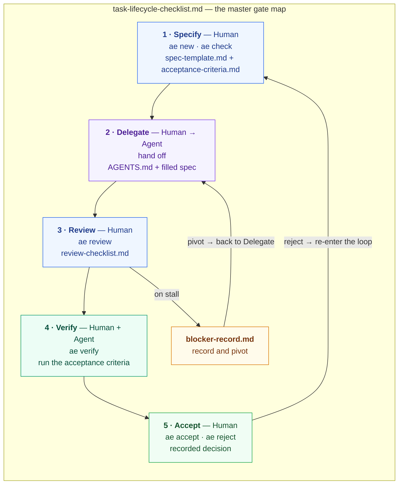

# Agentic Engineering — Spec-Driven Development Toolkit

A reusable toolkit extracted from *Agentic Engineering* (ed. 2.0). The book's core
claim: **the task specification is the single load-bearing artifact** of the agentic
workflow — review, verification, mutation control, and failure handling all hang off
it. These files turn that claim into fill-in-the-blank working surfaces you copy into
your own project.

## Get the kit

One-time setup — put the kit files **inside your project**, in the directory you'll run
the agent from. Download or clone this repo, then copy `ae`, `AGENTS.md`, and the five
templates (see **Files**) into your project:

```bash
git clone https://github.com/machinelearning2014/agentic_engineering.git
cp agentic_engineering/ae agentic_engineering/AGENTS.md \
   agentic_engineering/{spec-template,acceptance-criteria,review-checklist,blocker-record,task-lifecycle-checklist}.md \
   /path/to/your-project/
```

`./ae` is run from that project directory, and it creates `tasks/` there — so the
**Scope** paths in your spec are relative to your project.

## Quick start

From your project directory (the one containing `ae`), per task:

```bash
./ae new getuser-retry                          # scaffold tasks/getuser-retry/spec.md
#     … fill in EVERY field …
./ae check getuser-retry                        # lint: no blanks, criteria executable
#     … hand the spec to your agent …
./ae review getuser-retry                       # auto-detects diff facts + scaffolds review.md
#     … review the facts, check off all 8 items …
./ae verify getuser-retry                       # run the acceptance-criteria commands
./ae accept getuser-retry --evidence "npm test green"   # record the decision
```

See `example.md` for a complete filled-in run.

## How it works

The five-stage loop — **Specify → Delegate → Review → Verify → Accept**
(or reject → re-enter) — gated at every stage by `task-lifecycle-checklist.md`, the
master map. Each stage has one `ae` command and one working surface:



The **human** authors the spec and owns three irreplaceable decisions — specification,
review, acceptance. The **agent** executes inside the scoped loop and returns a diff +
evidence; verification is run by both, independently. The agent is a capable executor
and an untrustworthy authority — accept nothing on its word.

The five files fit the loop as one **input** (`spec-template.md`), one **how-to**
(`acceptance-criteria.md` — teaches the spec's criteria), one **inspection**
(`review-checklist.md`), one **exception path** (`blocker-record.md` — on a stalled
route), and one **master map** (`task-lifecycle-checklist.md`).

"Copy" throughout this kit means **duplicate a file**, not clone this repo — cloning
is only how you obtain the kit once; `./ae new <task>` is what instantiates a spec per
task.

**Two paths.** The kit works with or without `ae`:

1. **Manual** — copy the templates, fill them in, and run the checklists by hand. The
   Markdown files are the whole toolkit; nothing requires the script.
2. **Semi-automatic** — use `ae` to scaffold, lint, review, verify, and record. It
   discovers the mechanical facts (diff, scope, deps, criteria exit codes); the
   decisions stay yours.

## Files

| File | Source (book) | Purpose |
| --- | --- | --- |
| `spec-template.md` | Ch. 18.1 | Objective, scope, do-not-change, publication intent, criteria, output contract |
| `acceptance-criteria.md` | Ch. 18.2 / 7.4 | Turn adjectives into executable checks |
| `review-checklist.md` | Ch. 18.3 / 8.6 | Review the diff as evidence before accepting |
| `blocker-record.md` | Ch. 18.4 / 11.6 | Record a stalled route and pivot |
| `task-lifecycle-checklist.md` | Ch. 20 / 6 | End-to-end gate checklist for the loop |
| `AGENTS.md` | — | Standing instructions the agent reads before working |
| `ae` | — | Task helper: `ae new/check/review/verify/blocker/accept/reject/status` |
| `example.md` | — | A fully worked run of the kit on one small task |
| `openspec-comparison.md` | — | How this kit relates to the OpenSpec framework |

## The `ae` helper

One command per stage (plain bash, no dependencies):

| Command | What it does |
| --- | --- |
| `./ae new <task>` | Scaffold `tasks/<task>/spec.md` |
| `./ae check [<task>]` | Lint the spec: no blanks, criteria executable, one publication-intent checkbox |
| `./ae blocker <task>` | Scaffold `tasks/<task>/blocker.md` |
| `./ae review <task>` | Scaffold `tasks/<task>/review.md` — auto-detects changed files, scope (paths or globs), deps, test changes |
| `./ae verify [<task>]` | Run the acceptance-criteria commands; records `tasks/<task>/verify.md` |
| `./ae accept <task> --evidence "…"` | Record ACCEPT (refuses unless check + verify pass) |
| `./ae reject <task> --reason "…"` | Record REJECT |
| `./ae status` | Show each task's check, review, verify, and decision state |

`check` and `verify` exit non-zero on failure, so they work as CI gates.

## The six load-bearing principles (book, Ch. 4)

1. Own intent, architecture, and acceptance.
2. Specify before you delegate.
3. Review code as evidence.
4. Verify before you accept.
5. Control mutation and publication.
6. Treat failure as route failure.

> The agent is a capable executor and an untrustworthy authority. Accept nothing on its
> word; climb the trust ladder from skepticism to a recorded acceptance.
